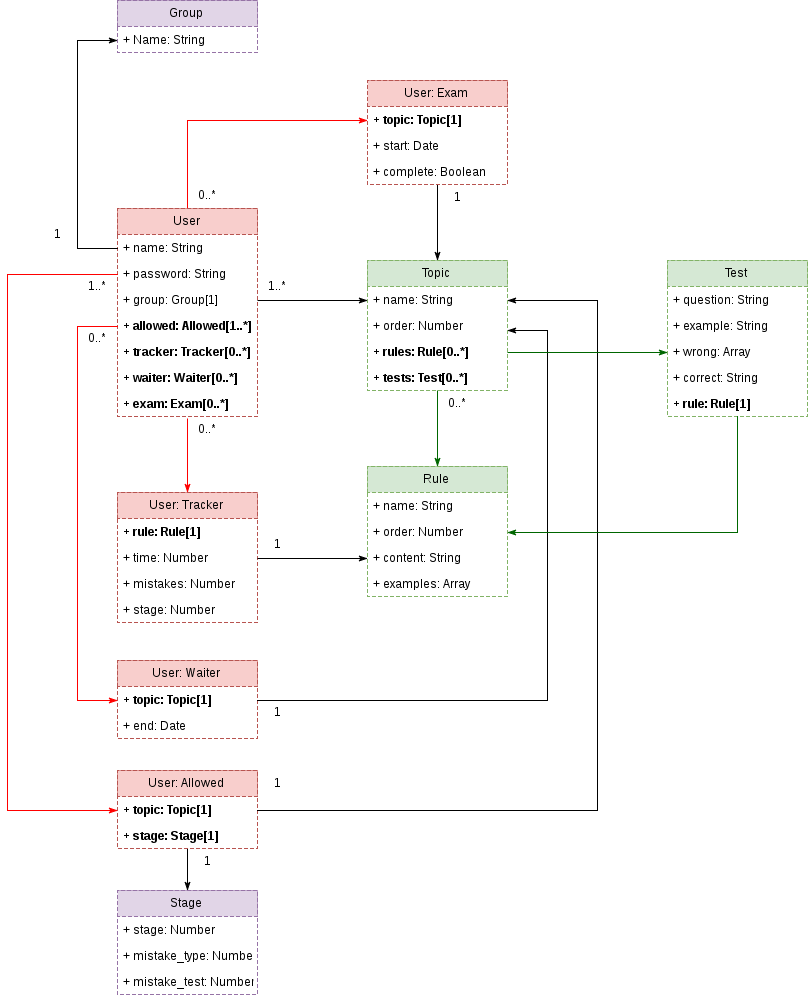

# Type English

Type. Wait. Type. Wait. Type. Wait. Ty...

## Description

**Type English** is a collection of english grammar rules. The basic idea is typing and again typing sentences by english grammar rules. There are groups of rule in specific topics. At the start of learning allowed only one topic with rules (Present Simple for example). To unlock more topics you should make an effort and be patient. You should work hard in order to learn what English is!

Every rule has few examples with construction of following rule. You should type this examples to pass next rule. The application counts a typing speed and amount of mistakes while you are typing. If you have many mistakes or very slow speed the application doesn’t allow you to next rule.

When you complete each rule in topic you should wait eight hours and then you'll get next **STAGE 2**. It’s same rules in same topic, but you must make very small amount of mistakes to pass. When you complete it, you need wait eight hours again for the next **STAGE 3**. That is last stage. There you must not make any mistakes! Well then, if you can complete it, new topic with new rules will be unlocked.

And after ten days of passing topic, you need to pass the exam. At this point every opened topics gets locked and you must type examples from you old topic you pass ten day ago without mistakes! After complete it, opened topics by you come back.

## DataBase Structure

## Conclusion

I can't see any easy way of learning english. Every sweet Victory requires hard patience and experience. You should repeat rules and work pretty hard out. If you don't like my idea, you can leave my website alone.

